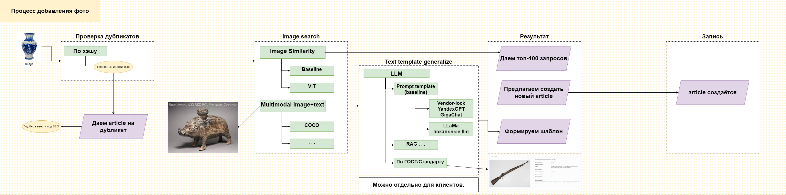
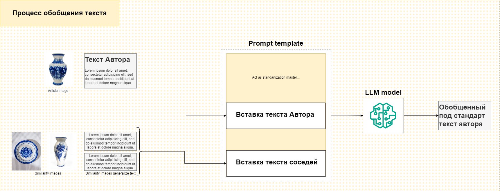
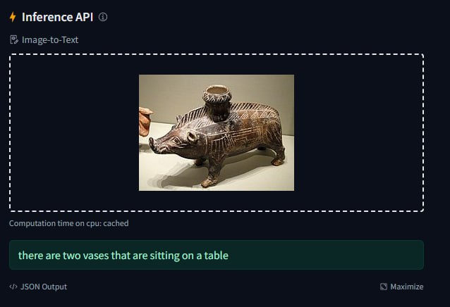

# Описание
Проект по хакатону Цифровой Прорыв 2024 ЮФО на тему "Поиск музейных предметов"

## Состав команды
- Teamlead, ML, Speech — Жданов Александр Сергеевич
- Fullstack, ML — Вебер Артем-Дариус Алексеевич
- ML — Тищенко Дмитрий Александрович

# Build/Deploy
Дариусу расписать

# Фичи проекта

# Структура прототипа
## Дизайн пайплайна поиска по фото

## Дизайн пайплайна обобщения текста

# Исследование
## Предложение
Реализация поисковой системы экспонатов музея через методы обработки естественного языка (NLP)

## Почему только img2text не выход

## Использованные модели
