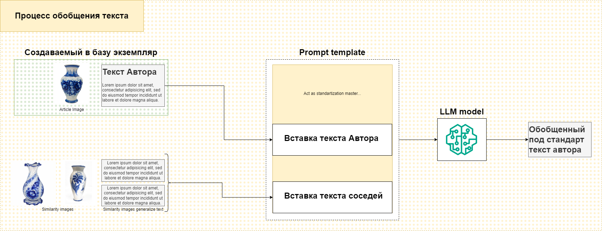

# Описание

Проект по хакатону Цифровой Прорыв 2024 ЮФО на тему "Поиск музейных предметов".

## Состав команды

- Teamlead, ML — `Тищенко Дмитрий Александрович`
- ML, Speech — `Жданов Александр Сергеевич`
- Fullstack, ML — `Вебер Артем-Дариус Алексеевич`

# Build/Deploy

<!-- TODO: Дариусу расписать -->

# Фичи проекта

## Векторный поиск

- Поиск изображений по вектороной базе данных
- Концепт использования эмбединга изображения и текста совместно для более точного семантического поиска

## Стандартизация текста

- Работа языковой модели для стандартизации текста по шаблону
- Концепт масштабирования стандартизации текста на большие данные

## Классификация

- Использование в тетрадях Yolov7 для классификации текста
<!-- TODO: уточнить -->

# Структура прототипа

## Дизайн пайплайна поиска по фото

## Дизайн пайплайна обобщения текста
<!-- TODO: добавить -->

# Исследование

## Предложение

Реализация поисковой системы экспонатов музея через методы обработки естественного языка (NLP)

## Почему только img2text не выход

## Концепт пайплайна обобщения текста

На рабочие данные необходим пайплайн через стандартизацию путем использования данных с соседей, вероятно, в том числе и изображения.

## Концепт масштабирования стандартизации на большие данные

Редуцированный подход, в котором экземпляры ранижируются по ревелантности своих данных

Таким образом, при прохождении от наиболее ревелантным к наименее, мы можем формировать единый формат записи текста. Также можно рассмотреть переобобщение записей после 1 итерации.

# Использованные модели
<!-- TODO: добавить ссылки на модели -->
